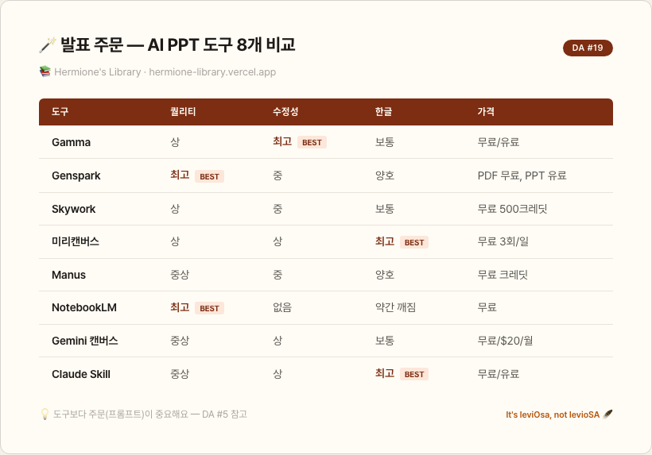

# DA 수업 #19 — 발표 주문, 어떤 지팡이가 좋을까 🎤

> DA#10에서 AI로 발표자료 만드는 법을 배웠어요.
> 오늘은 한 걸음 더 — 어떤 도구(지팡이)로 만들어야 하는지, 8개를 다 써보고 비교했어요.

---

## 결론부터 — 상황별 추천

| 이런 상황이라면 | 추천 지팡이(도구) |
|---|---|
| 퀄리티만 중요, 수정 불필요 | NotebookLM |
| 한국 스타일 + 웹 수정 | 미리캔버스 미리클 |
| 웹에서 쉽게 수정 | Gamma |
| 복잡한 도표 + 수정 가능 | Genspark |
| 무난 + 수정 잘됨 | Gemini 캔버스, Claude Skill |
| 크레딧 절약 | Skywork, Manus |

> 💡 비유: 올리밴더 가게에 지팡이가 여러 개 있는 것처럼, PPT 도구도 상황에 맞는 게 따로 있어요. 모든 마법에 만능인 지팡이는 없어요.

---

## 8개 도구 한눈에 비교



---

## 1. Genspark — 결과물 퀄리티 최고

복잡한 도표나 차트도 잘 구현하고, 한글 PDF를 첨부하면서 영어로 바꿔달라고 할 수도 있어요.

| 장점 | 단점 |
|---|---|
| 결과물 퀄리티 최고 | 크레딧 소모 |
| 복잡한 도표 구현 가능 | 수정 기능이 Gamma만큼 다양하지 않음 |
| 한국어 지원 양호 | 도형 구조가 어그러질 때 있음 |

> 💡 비유: 올리밴더의 최고급 지팡이 — 비싸지만 마법이 화려해요.

---

## 2. Gamma — 속도와 수정의 왕

주제 한 줄이면 10장이 자동으로 나와요. Agent 기능(대화형 수정)으로 "다이어그램 추가해줘"하면 알아서 채워줘요.

| 장점 | 단점 |
|---|---|
| 생성 속도 빠름 | 디자인이 살짝 심플 |
| 수정 가장 편리 + Agent 대화형 | PPT 내보내기 후 폰트 변경 필요 |
| 다이어그램 자동 생성 | 워터마크 제거 필요 |

<details>
<summary>▸ PPT 내보내기 후 체크리스트</summary>

| # | 할 일 |
|---|---|
| 1 | 16:9 비율 넘어가는 텍스트 크기 조정 |
| 2 | 서식 > 폰트바꾸기에서 폰트 일괄 변경 |
| 3 | 슬라이드마스터에서 Gamma 워터마크 제거 |

</details>

---

## 3. Skywork — Genspark의 무료 대안

Genspark과 비슷한 퀄리티인데 무료 500크레딧을 줘요. 크레딧이 부족할 때 대안으로 딱!

| 장점 | 단점 |
|---|---|
| 무료 500크레딧 | Genspark 대비 미세하게 퀄리티 낮음 |
| PPT 다운로드 가능 | |
| 문서, 엑셀, 팟캐스트까지 지원 | |

---

## 4. 미리캔버스 미리클 — 가장 한국적인 AI PPT

한국 스타일 템플릿이 진짜 깔끔해요. 프롬프트(주문 문구) 2만자까지 입력 가능하고, PPT는 하루 3번까지 무료 다운로드.

| 장점 | 단점 |
|---|---|
| 한국 스타일 템플릿 최고 | 복잡한 도표/차트는 아쉬움 |
| 웹 수정 기능 풍부 | |
| 하루 3회 무료 PPT 다운 | |

> 💡 한국 고객 대상 발표라면 미리캔버스가 1순위예요. "한국 스타일"이 자동으로 나오거든요.

---

## 5. Manus — PPT + 데이터 시각화 강자

생키차트, 버블차트, 워드클라우드 같은 고급 차트를 PPT 안에 넣을 수 있어요.

| 장점 | 단점 |
|---|---|
| 고급 데이터 시각화 | 디자인 감성은 약간 아쉬움 |
| 무료 PPT 다운로드 | |
| 구글 슬라이드 변환 가능 | |

---

## 6. NotebookLM — 수정 못 해도 퀄리티는 최고

문서나 URL을 넣으면 고퀄리티 슬라이드가 나와요. 단, **PDF로만 다운로드 가능하고 수정 불가**.

| 장점 | 단점 |
|---|---|
| 결과물 퀄리티 최상 | PDF만 다운, 수정 불가 |
| 소스 기반 정확한 내용 | |
| 완전 무료 | |

<details>
<summary>▸ NotebookLM 퀄리티 올리는 꿀팁 주문</summary>

이 주문(프롬프트)을 추가하면 퀄리티가 확 올라가요:

1. 모든 콘셉트를 소스 자료 기반 시각적 메타포로 변환
2. 통계는 원형 차트, 진행률 바, 아이콘 기반 차트로 시각화
3. 검증된 바이럴 레이아웃 사용 (히어로/대비/프로세스플로우/타임라인)
4. 헤드라인 최대 8단어, 본문 15단어 제한
5. 소스 자료에만 명시된 개념 사용 (헛소리 방지)

> 저도 이거 발견했을 때 "어머, 이거 진짜 되는 거예요?!" 했어요 😅

</details>

---

## 7. Gemini 캔버스 — 구글 생태계에서 바로

딥리서치(심층 검색) 후 같은 대화창에서 슬라이드 변환을 요청하면, 리서치 내용이 그대로 반영된 PPT가 나와요.

| 장점 | 단점 |
|---|---|
| 구글 슬라이드 바로 내보내기 | 디자인이 심플한 편 |
| 딥리서치 연동 | 한글 일부 어색 |
| Google Workspace 통합 | |

> 💡 비유: 호그와트 도서관(Google Workspace)에서 바로 쓸 수 있는 지팡이예요.

---

## 8. Claude Skill (Slidev) — 한글이 안 깨지는 PPT

Claude Code에서 스킬(저장된 주문)을 설치해서 PPT를 만들 수 있어요. **한글 텍스트가 진짜 안 깨져요**.

| 장점 | 단점 |
|---|---|
| 한글 안 깨짐 | 초기 설정 필요 |
| 템플릿 커스터마이징 가능 | |
| 스킬 마켓플레이스 활용 | |

> DA#13(나만의 주문 만들기)에서 배운 스킬이 여기서 쓰이는 거예요!

---

## PPT 만드는 4가지 접근법

어떤 도구를 쓰든, 만드는 방법은 4가지예요.

| 방법 | 설명 | 언제 쓰나 |
|---|---|---|
| **1줄 주제로 바로** | 주제만 입력 → 자동 생성 | 빠르게 시안 뽑을 때 |
| **딥리서치 → 변환** | 심층 검색 후 슬라이드 전환 | 데이터 기반 발표 |
| **목차 확정 → 생성** | 목차+내용 먼저 → 도구에 넘기기 | 크레딧 절약, 정확도 ↑ |
| **HTML 1장씩 캡처** | 16:9 HTML 생성 → 캡처 → PPT에 붙이기 | 디자인 자유도 최고 |

<details>
<summary>▸ 방법 3 — 목차 확정 주문(프롬프트) 예시</summary>

```
[주제]에 대한 PPT를 만들려고 해.
15장에 대해서 각 장표의
- 제목
- 2줄의 상세 설명
- 삽입 비주얼 요소 종류(이미지, 구조도, 표 등 중 1개) 및 설명
- 기타 삽입 정보
구성해줘. PPT를 만들기 전에 텍스트로 먼저 줘.
```

> 이렇게 목차를 먼저 받으면 수정을 최소화할 수 있어서 크레딧도 아끼고 결과도 좋아져요.

</details>

---

## 뻔한 PPT vs 주문 잘 쓴 PPT

| | 기본 설정 | 주문(프롬프트) 잘 쓴 버전 |
|---|---|---|
| 결과 | 일반적, 뻔한 구성 | 브랜드 컬러 반영, 레이아웃 맞춤 |
| 차이 포인트 | 색상/폰트/레이아웃 랜덤 | 색상 팔레트 + 레이아웃 타입 + 글꼴 지정 |

> 💡 DA#5(주문 문구의 기술)에서 배운 거예요 — 구체적으로 지시할수록 결과가 좋아져요. It's leviOsa!

<details>
<summary>▸ PPT 퀄리티 올리는 주문 꿀팁</summary>

색상, 레이아웃, 이미지 스타일, 글꼴, 시각적 강조 요소를 구체적으로 지정하면 템플릿 선택 없이도 원하는 디자인이 나와요.

```
PPT를 만들어줘. 다음 조건으로:
- 색상 팔레트: 네이비(#1B365D) + 골드(#C5A55A)
- 레이아웃: 히어로 이미지 + 텍스트 오버레이
- 글꼴: 제목은 Pretendard Bold, 본문은 Pretendard Regular
- 헤드라인: 8단어 이내
- 본문: 15단어 이내
- 시각 강조: 핵심 수치는 큰 폰트 + 색상 강조
```

</details>

---

## 무료로 시작하는 추천 순서

| 순서 | 도구 | 무료 범위 |
|---|---|---|
| 1 | NotebookLM | 완전 무료 (Google 계정만) |
| 2 | Skywork | 무료 500크레딧 |
| 3 | Manus | 무료 500크레딧 |
| 4 | 미리캔버스 | PPT 다운 3회/일 |
| 5 | Gamma | 무료 플랜 있음 |

---

## 지금 바로 해보세요

| # | 할 일 | 체크 |
|---|---|---|
| 1 | 위 표에서 내 상황에 맞는 도구 하나 고르기 | ☐ |
| 2 | 같은 주제로 PPT 하나 만들어보기 | ☐ |
| 3 | DA#5의 주문 기술(배경+형식+예시)을 적용해서 다시 만들어보기 | ☐ |
| 4 | 차이를 느끼면 — 주문의 힘을 체감한 거예요! | ☐ |

---

> 정리: **도구 자체보다 주문(프롬프트)을 얼마나 잘 쓰느냐가 핵심이에요.** 목차를 먼저 확정하고, 색상과 레이아웃을 구체적으로 지정하는 것만으로도 결과물이 확 달라져요.

다음 수업에서 만나요!

Revelio. 8개의 지팡이를 다 써봤더니, 숨어있던 최적의 조합이 보이기 시작했어요 🔍✨
